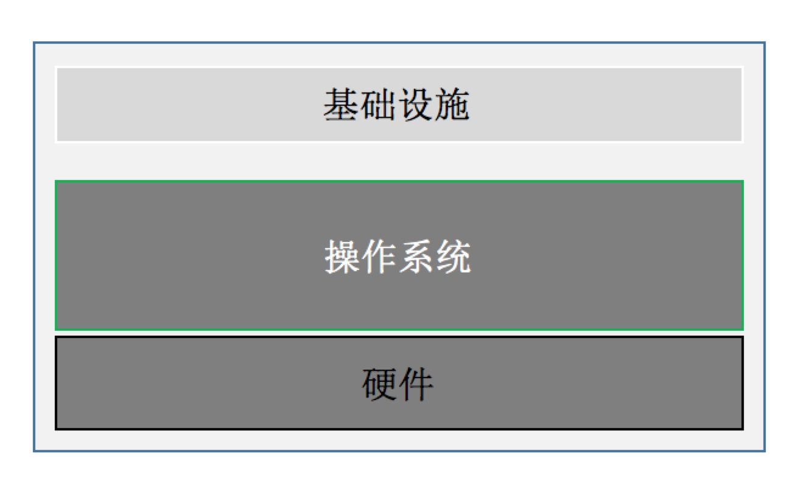
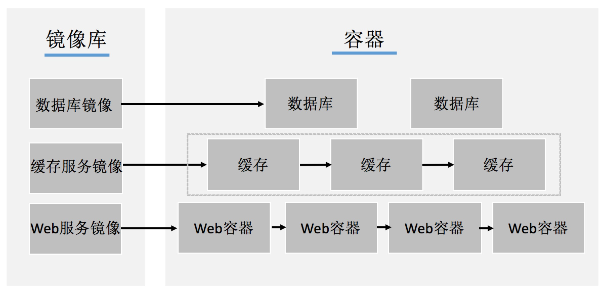
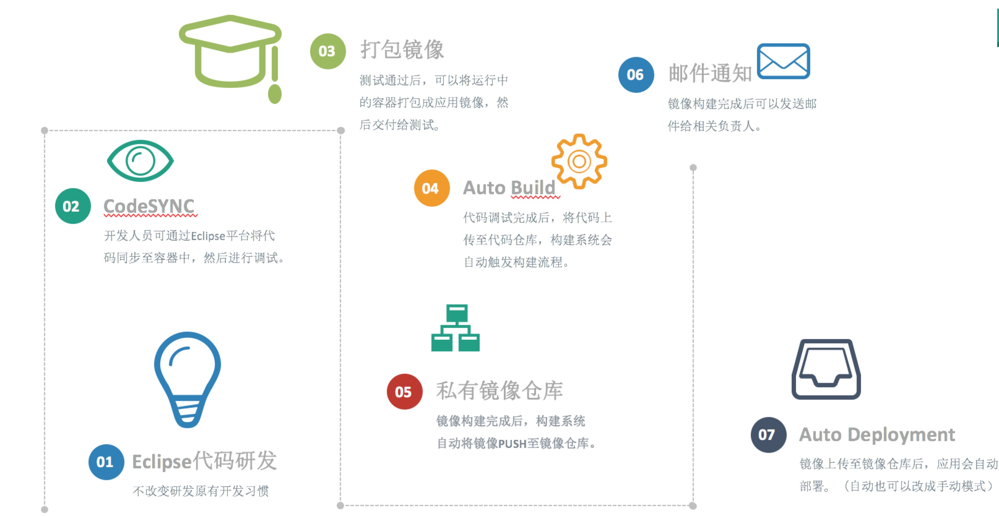
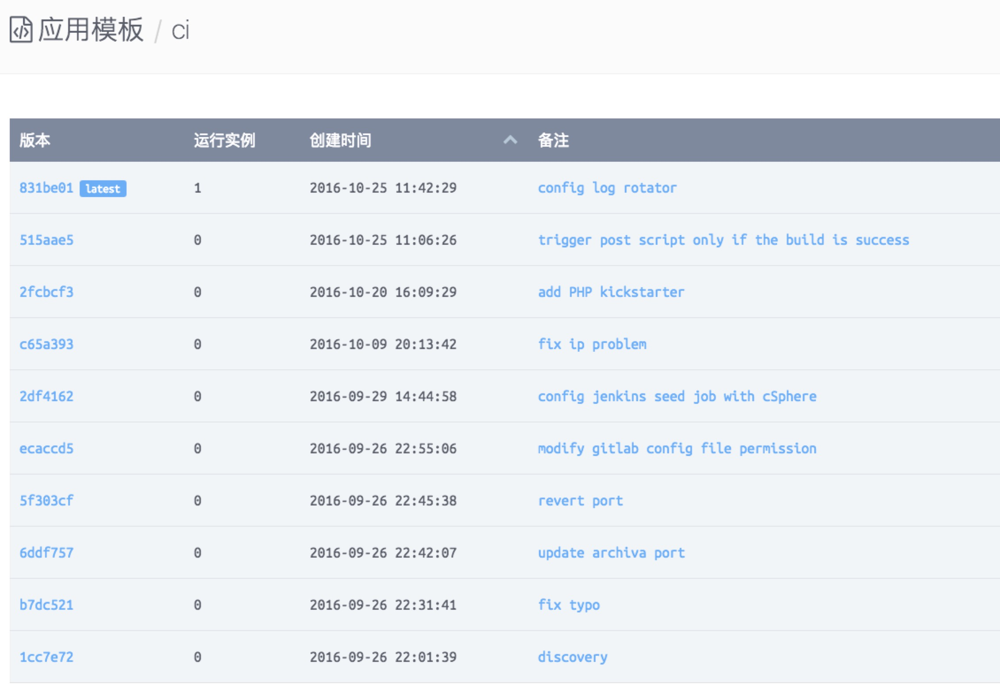
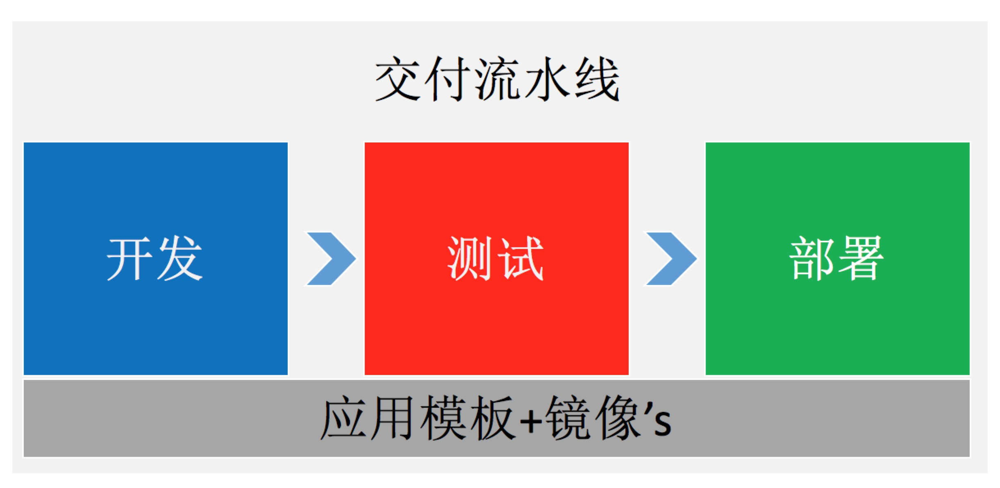
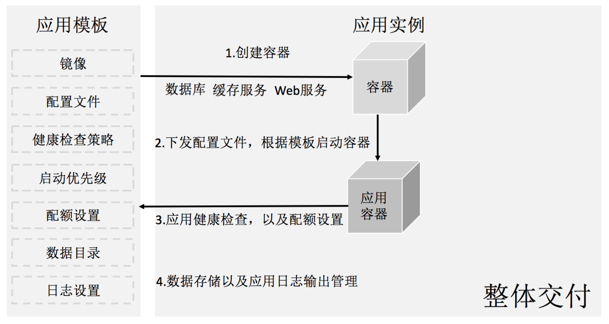
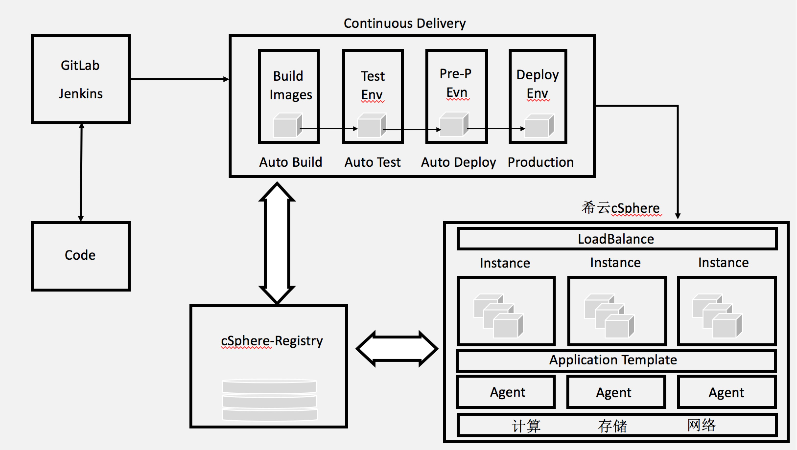

> 各位好，我是希云cSphere技术总监张春源；今天和大家分享一下为何会选择容器技术来构建持续交付/持续发布系统。

# 利用容器技术构建持续交付/持续发布系统

## 概述

提到软件发布确实是很令人头疼的一个过程，且还是高风险动作。借用一句话：“99%的故障是由于变更引起的”。本次分享内容着重介绍使用容器技术实现自动化构建、部署和测试过程，并使得开发、测试、运维之间能更好的协作，最终可以在几个小时甚至几分钟的时间，实现可重复，且可靠的软件发布系统。

## 常见场景

- 在开发测试环境中测试均没有问题，但上生产环境的时候会有问题。即使我们在开发测试环境中部署上万遍没问题，但从来没有在生产环境中部署过一次，每到在新版本发布时，大家不仅要加班，而且都还很紧张。如果没有很好的回滚策略，即使发布成功了心还是悬着。

- 移动互联网飞速发展，业务要求敏捷，要在很短的时间完成从开发到上线的任务。很多企业从开发到上生产的周期都要花好几个月的时间完成，现有IT架构跟不上业务发展。

- 软件项目开发完成后，要将开发好的版本交付到客户的环境中。目前常见的做法是按照长长的安装文档，且是通过手动安装完成，此种模式不仅对安装实施人员的要求高，且出错几率很高。

## 构建持续交付/持续发布系统需要考虑

- 环境管理

环境包括硬件和软件，对于软件环境一定要能对硬件解耦，这样即使在硬件坏的情况下可以在很短的时间内将软件环境部署到新的硬件上。除此之外，好的环境管理方式能有效降低在生产环境中部署的风险。

**实践推荐：环境的管理在项目开始的时候，开发团队和运维团队就应该全面合作，后面的事情就会变的很容易。**



- 组件和依赖管理

很多系统都是由多个组件组合起来对外提供服务。组件内部要依赖库文件，组件之间也有复杂的依赖关系。一套复杂的系统部署起来依赖的处理是非常重要的。组件以及依赖关系的更新，要能以增量的形式进行，并形成不同的版本。

- 配置管理

配置管理记录了项目演进的过程。好的配置管理系统在非常短的时间内能创建出任何的环境；批量更新线上系统的配置信息且能保证更新失败回退到能正常运行的版本；不仅能满足本部门的需求同样也能满足其他部门的需求，以及不同环境之间的需求。

- 版本管理

在持续交付和持续发布的过程中，任何一个细节都应被记录（操作系统，中间件，代码，配置文件，依赖信息等），并且形成版本。

**小提示：程序中不要把在不同环境部署时变化的参数写死，推荐使用名称。如：连接外部数据库地址、用户、密码等信息。**

- 持续交付管理

在交付的过程中，任何原因都有可能导致部署失败。失败不可怕，可怕的是不知道怎么失败的。明枪易躲暗箭难防道理让我们明白，软件项目的交付要复杂的多，所以建设持续交付系统一定要建立可重复且可靠的部署流水线，较完善的配置管理系统，以及操作审计系统。问题越早发现修复起来的成本越低，且更好地保证成功的发布上线。

## 为何选择使用容器

以Docker为代表的容器技术，在短短的时间内发展迅速。容器技术早在2008年已经出现，Docker公司厉害的是提供了将软件运行环境整体打包的技术-**镜像**。

现实中很多不标准化的交付，使用镜像都可以实现标准化。标准化以后可以更好的实现自动化，并且能更好的促进上游和下游的发展。如：开发、测试、运维之间能更好的协助，践行DevOps文化。

## 持续交付

**原则：可重复、可靠；自动化；版本控制；团队责任；**

- 可重复、可靠

镜像将软件的运行环境以及软件代码打包起来，我们可以基于同一个镜像在不同的环境中生成一模一样的环境。因为容器就是进程，所以一个容器中推荐只运行一个服务。对于企业而言单容器是干不成事的，需要利用编排系统将多个镜像编排起来（镜像/版本、应用配置文件、启动优先级设置、日志处理、数据处理等）形成应用模板。通过应用模板可以重复，且可靠的将应用部署到不同的环境中，实现持续交付第一步。



- 自动化

容器技术在持续集成方面不仅仅解决了CI的问题，并且很好的解决了CD。利用容器实现持续交付区别于传统的做法是，原来开发交付出来的都是软件包和安装部署文档；利用容器技术开发人员交付的是**应用模板+镜像**，应用模板替代了安装部署文档，镜像技术更可靠的完成了软件包和软件运行环境的交付。并利用CI工具实现了，开发人员提交代码到代码库中，通过钩子可自动触发构建镜像。并可以对镜像以及应用做测试。



- 版本控制

容器要比虚拟机更接近应用层，从叫法上来说虚拟机一般都叫虚拟机，但容器大家都会说是MySQL容器，Tomcat容器。容器更加细化到了应用层。上面我们也都说到了，环境的变更，应用的版本或者是底层操作系统以及库的变更都能做到增量式的版本管理。镜像可以通过Tag来实现版本的管理，应用模板、配置文件、依赖关系等信息同样在企业实际应用中应严格要求通过版本来进行管理。



- 团队责任

DevOps不是一种工具，是一种文化。整个持续交付流程能顺利的建立起来，仅依靠一个人或一个部门基本上建立不起来。在我们给中英人寿保险有限公司利用容器建立持续交付系统的过程深刻的感受到，需要让实际业务团队共同的参与，才真正能最大化容器的优势。容器技术是比较先进，但业务不关心先进性，重点看实际效果。所以DevOps不是个人运维或者开发人员的责任，必须是团队的责任。

利用容器实现的交付流水线：



## 持续发布

一切皆模板，服务于应用!



基于容器实现持续发布系统如下：



*注解：

```
1.开发人员将代码提交至代码仓库

2.通过钩子自动触发构建镜像流程

3.镜像构建完成后，push到镜像仓库Registry

4.有新版本进行生成，自动触发部署流程，部署至测试环境

5.测试工作完成后，标记镜像状态为成功，自动触发部署至准生产环境

6.准生产环境测试完成后，可自动或半自动部署业务

```


