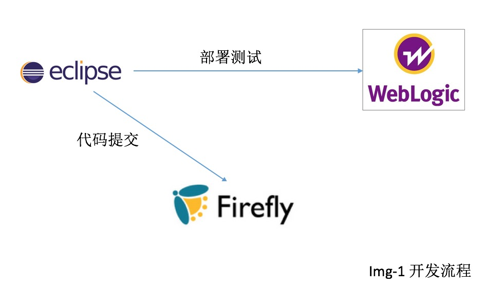
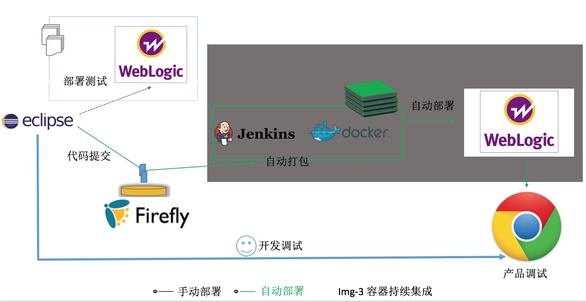
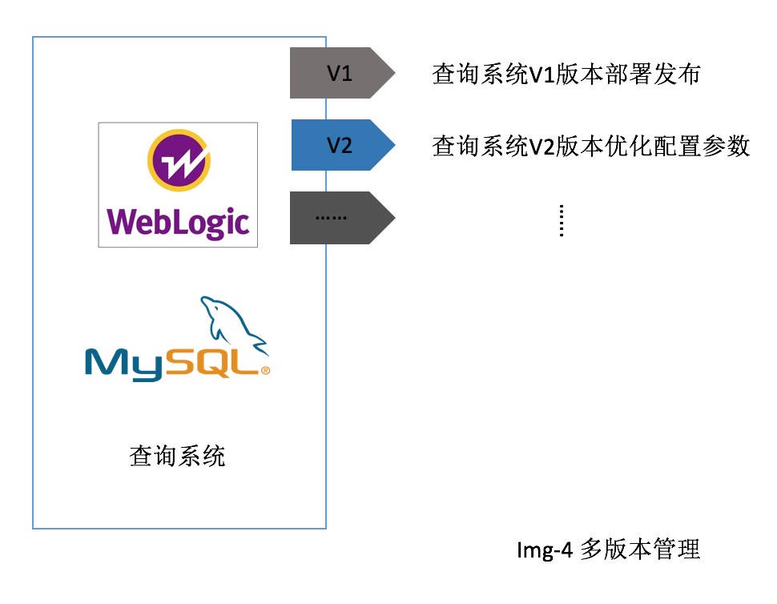
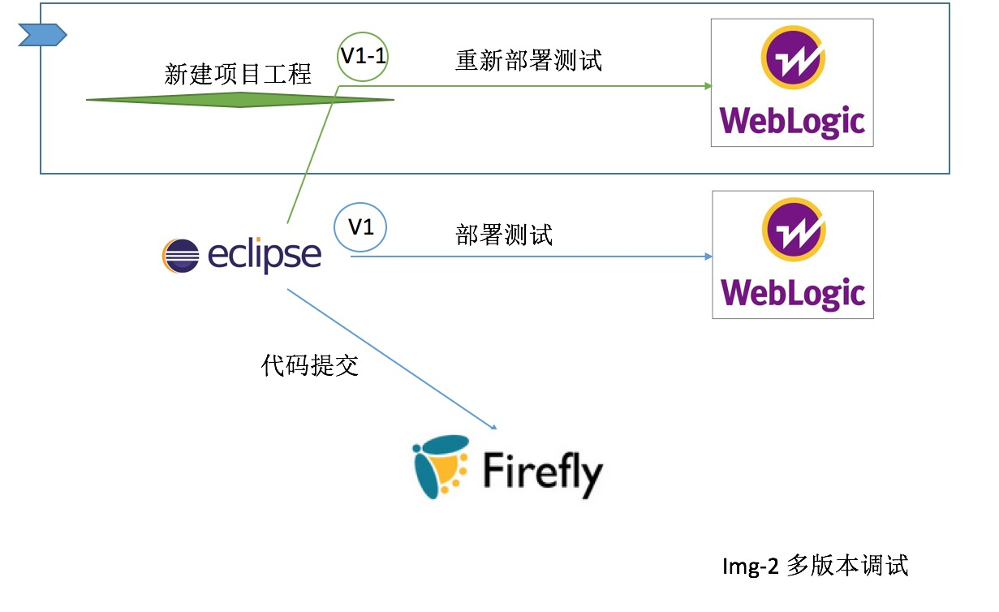
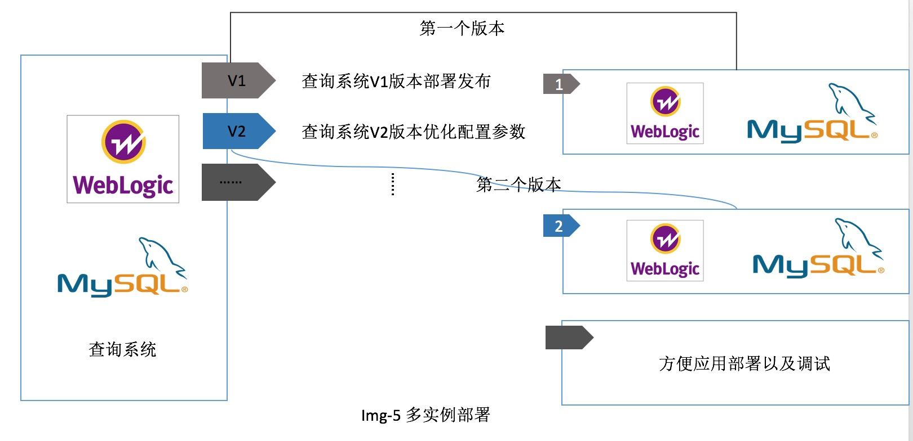
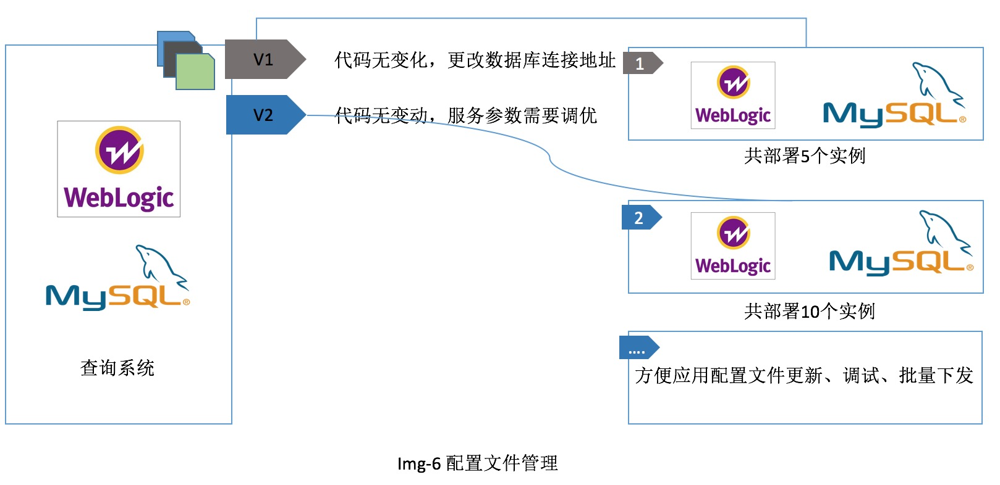
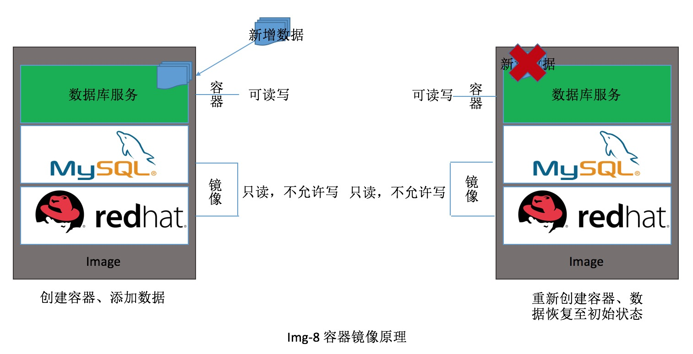
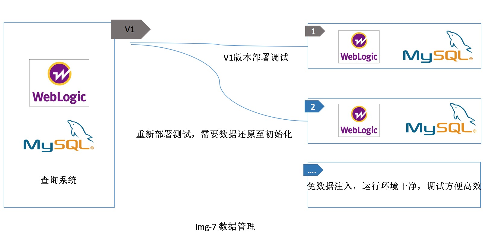

# 参赛项目规划

> 通过容器技术实现产品代码开发阶段的持续集成和持续交付；

## 现状概述

### 创建工程

> 通过eclipse新建工程项目,编写代码，并部署进行测试

 

### 配置文件管理

> 配置文件是代码组成的一部分，主要定义了数据库连接地址，以及服务配置参数等。配置文件手动进行配置，且修改后无版本管理

### 部署

> 点击部署（通过ftp将war包上传至服务器中），根据当前系统环境，手动对服务进行配置

### bug调试

> 产品本地开发环境测试没问题，将产品发布到服务器后，发现程序运行有问题，需要Debug。此时无法判断是服务运行环境有问题，还是代码的问题，需要花大量时间查找问题

### 多版本调试

> 多版本之间调试，需要在eclipse中再重新创建工程项目。调试代码后构建新版本的war包，再次将war上传到服务器进行手动配置，最后做产品调试

### 数据库管理

> 服务配置文件数据库地址在不同的环境中地址不同，部署时需要手动进行修改；

> 产品进行调试时需要从数据库中注入测试数据，调试期间会有新数据生成。重新调试时，需要将数据还原为初始数据

## 基于容器的持续集成和持续交付

### firefly和Jenkins集成

> 1.可通过eclipse直接调用容器管理平台API将war包直接上传至容器中，开发人员即可打开浏览器做产品调试

> 2.firefly和jenkins集成后，jenkins自动探测是否有新代码提交，如有新代码提交会自动触发构建系统，将构建好的容器镜像上传至镜像仓库，并触发自动部署流程。

以上步骤，只需要项目新创建的第一次做配置，后续的模式就是提交完代码后即可打开浏览器做调试。

### 多版本管理

> 利用容器平台中的应用模板，将多个容器（服务）进行编排形成应用模板，并且每次修改应用模板后会保留新的版本号，方便产品多版本之间切换。

### 多版本调试

> 应用模板有多个版本，可通过不同模板部署不同的应用实例来做debug。利用容器技术除解决了环境一致性问题外，开发人员还可以随用随建整套应用进行调试，并可以在多个版本之间随意切换。

### 多实例部署

> 通过应用模板的某个版本可以部署多个应用实例，方便代码调试和定位问题。

### 配置文件管理

> 产品代码没有更新，配置文件参数需要优化，可以直接进行修改配置文件即可生效，不需要重新打war再部署，可有效提升代码调试效率。

> 配置文件中定义了连接数据库的地址，在不同的环境中数据库地址不同，通过配置文件管理可以实现应用在多个环境之间的交付。

> 配置文件经常会修改，每次修改均会保留版本号，可以方便调试以及配置文件的高效管理。

### 镜像原理

> 容器镜像中打包了软件运行环境以及代码，实现了产品整体打包交付。容器镜像的属性是只读模式，通过镜像创建出来的容器才可以往里写数据。在容器中所产生的数据不会影响镜像中的数据。

### 数据管理

> 根据镜像原谅描述，镜像是只读，创建出来的镜像才可以写数据，如果把容器删除后数据即可回到初始状态，可以利用此特性有效的解决数据重复灌入和数据恢复的工作，有效提升开发效率。

